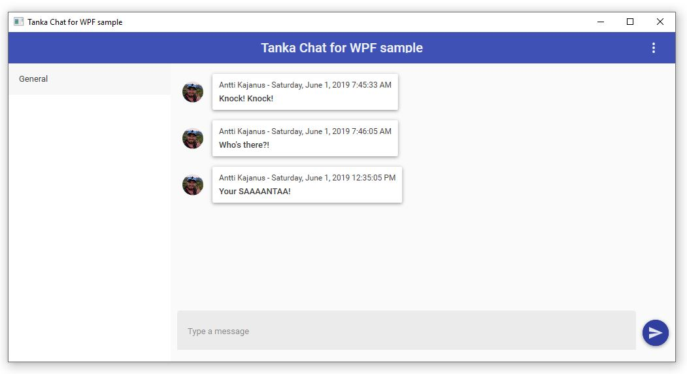

## Sample chat application using Tanka GraphQL 

A simple chat application using [Tanka GraphQL execution library](https://github.com/pekkah/tanka-graphql) based server using [ASP.NET Core SignalR .NET Client](https://docs.microsoft.com/en-us/aspnet/core/signalr/dotnet-client?view=aspnetcore-2.2). The sample solution (this repository) uses server from [https://github.com/pekkah/tanka-graphql-samples](https://github.com/pekkah/tanka-graphql-samples) repository and demonstrates how to use .NET client library to work with it. Currently the sample contains a WPF chat application that uses Auth0-authentication with GitHub account.   

